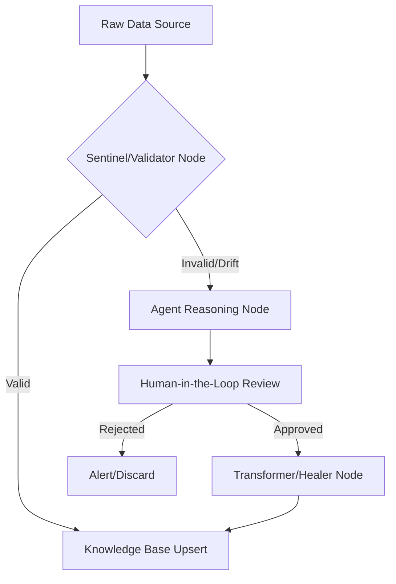

# Dify-Guardian-ETL

[](https://dify.ai)
[](https://python.org)
[](#)
[](https://opensource.org/licenses/MIT)

**Standard RAG pipelines are brittle.** In production, upstream data sources change—columns are renamed, data types drift, and "garbage" enters your vector store. 

**Dify-Guardian-ETL** is an intelligent "Gatekeeper" built for the Dify ecosystem. It uses Agentic Workflows to sense, reason, and repair data ingestion failures in real-time before they "poison" your Knowledge Base.

---

## 🚀 The Problem: The "Silent Fail"
Most RAG systems fail silently when:
1. **Schema Drift:** A CSV column `user_email` suddenly becomes `customer_contact`.
2. **Data Corruption:** Null values appear in critical "Context" fields.
3. **Format Mismatch:** Dates or currency formats shift, breaking the retrieval logic.

## 🧠 The Solution: The "Heal-Loop"
This project implements a 4-stage **Agentic ETL** workflow within Dify:

1. **Sentinel (Validator):** A deterministic runtime type-checker powered by `Pydantic v2` that strictly validates incoming data against a "Golden Schema".
2. **Diagnostician (Reasoning):** If validation fails, an Anthropic/OpenAI LLM diagnoses the schema drift and proposes a robust mapping (e.g., "Map 'customer_contact' → 'user_email'").
3. **HITL Gate (Human-in-the-Loop):** An interactive terminal review gate pauses pipeline execution, requesting admin sign-off before structural changes are applied.
4. **Healer (Transformer):** Python execution environment applies the approved repair using native dictionaries/Pandas, sanitizing the data safely into the Dify Knowledge Base.

---

## 🛠️ Architecture



---

## 🚦 Quickstart

### 1. Install Dependencies
Ensure you have Python 3.10+ installed.

```bash
# Clone the repository
git clone https://github.com/Shanyu-Dabbiru/Dify-Guardian-ETL-v2.git
cd Dify-Guardian-ETL-v2

# Optional: Set up a virtual environment
python -m venv venv
source venv/bin/activate

# Install requirements
pip install .[dev]
```

### 2. Configuration
Copy the sample environment file and add your actual API keys:

```bash
cp .env.example .env
```
_Note: You can run a purely local simulation without keys by ensuring `USE_SIMULATED_LLM=true` in your `.env`._

### 3. Run the Demo
Try ingesting a clean, valid dataset:
```bash
python -m src.orchestrator demo/golden.csv
```

Try ingesting a drift-corrupted dataset to watch the Agentic Healer kick in:
```bash
python -m src.orchestrator demo/drifted.csv
```

### 4. Run Tests
```bash
pytest tests/
```

---

## 📁 Directory Structure
```text
.
├── src/
│   ├── contracts/        # Data schemas and types (Pydantic)
│   ├── sentinel/         # Validation logic against Golden Schema
│   ├── diagnostician/    # LLM clients for self-healing reasoning
│   ├── healer/           # Data transformer and Dify KB ingestion API client
│   └── orchestrator.py   # Main entry point wiring all zones together
├── tests/                # End-to-end Pytest suite
└── demo/                 # Demo datasets
```
